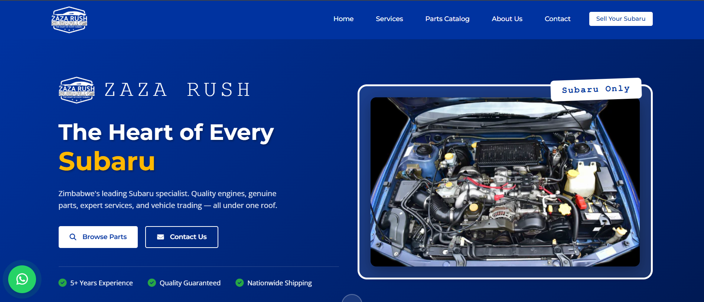
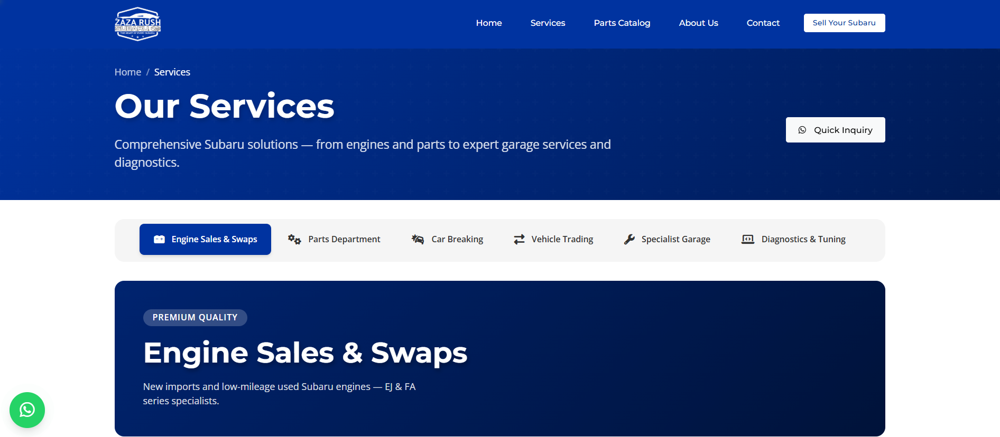
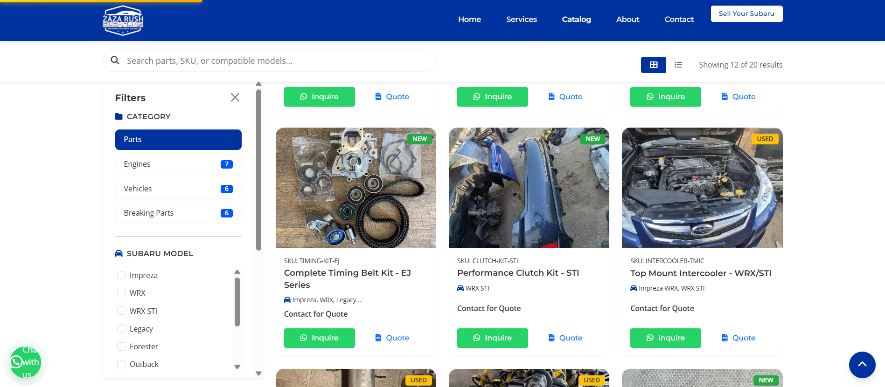
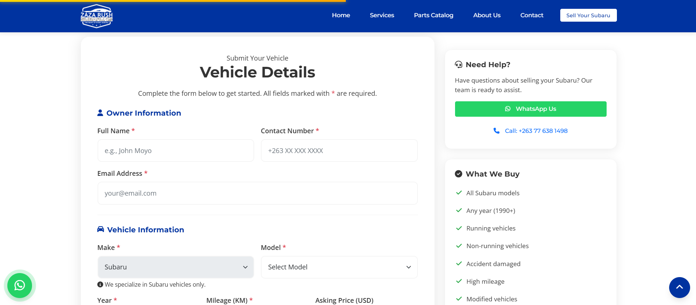

# Zaza Rush Subaru Website

> **Zimbabwe's Leading Subaru Specialist** - Professional website for Subaru parts, engines, services, and vehicle trading.



## Project Overview

Zaza Rush Subaru is a comprehensive web platform for Zimbabwe's premier Subaru specialist, offering:
- **Quality Engines** - EJ & FA series engines for all Subaru models
- **Genuine Parts** - Turbochargers, suspension, brakes, body parts, and more
- **Expert Services** - Specialist garage, diagnostics, and maintenance
- **Vehicle Trading** - Buying and selling Subaru vehicles
- **Car Breaking** - Quality used parts from breaking vehicles

### Live Website
[www.rushsubaru.com](https://www.rushsubaru.com)

---

## Features

### Homepage
- Hero section with dynamic carousel
- Featured products showcase
- Service highlights with icons
- Why Choose Us section
- Customer testimonials
- Statistics counter
- Call-to-action sections

### Services Page
- Tabbed service categories
- Engine sales & installation
- Parts department
- Specialist garage services
- Vehicle trading
- Car breaking services
- Comprehensive diagnostics

### Parts Catalog
- Dynamic product filtering
- Category-based navigation
- Search functionality
- Quote request system
- Product image gallery
- Stock status indicators
- Condition tags (New/Used)

### Contact Page
- Contact form with validation
- Interactive Google Maps
- Business hours & location
- Multiple contact methods
- Social media integration
- WhatsApp quick contact

### About Page
- Company story & mission
- Core values showcase
- Subaru expertise highlights
- Team introduction
- Facility photo gallery

### Sell Your Subaru
- Vehicle submission form
- Photo upload capability
- Condition assessment
- Mileage & year tracking
- Quick valuation process
- 4-step process guide

---

## Technology Stack

### Frontend
- **HTML5** - Semantic markup
- **CSS3** - Modern styling with variables
- **Bootstrap 5.3.3** - Responsive framework
- **JavaScript ES6+** - Interactive functionality
- **jQuery 3.7.1** - DOM manipulation

### Libraries & Plugins
- **AOS 2.3.4** - Animate On Scroll
- **Swiper 11.0.5** - Touch slider
- **Lightbox2 2.11.4** - Image gallery
- **SweetAlert2 11.10.5** - Beautiful alerts
- **Font Awesome 6.5.1** - Icon library
- **Google Fonts** - Montserrat & Open Sans

### Backend
- **PHP 8.2+** - Server-side processing
- **XAMPP** - Local development environment
- **JSON** - Data storage for catalog

---

## Project Structure

```
rushsubaru.com/
├── .github/
│   ├── assets/              # Logo and branding assets
│   ├── prompts/             # Development documentation
│   ├── screenshot/          # Website screenshots
│   └── user_requirements.md # Project requirements
├── api/
│   └── v1/                  # API endpoints (versioned)
│       ├── config.php       # Database configuration
│       ├── contact.php      # Contact form handler
│       └── vehicle.php      # Vehicle submission handler
├── assets/
│   ├── css/
│   │   ├── variables.css    # CSS custom properties
│   │   ├── style.css        # Global styles
│   │   ├── components.css   # Reusable components
│   │   ├── animations.css   # Animation definitions
│   │   ├── responsive.css   # Media queries
│   │   └── pages/           # Page-specific styles
│   ├── js/
│   │   ├── main.js          # Core JavaScript
│   │   ├── navigation.js    # Navigation logic
│   │   ├── catalog.js       # Catalog functionality
│   │   ├── forms.js         # Form validation
│   │   └── whatsapp.js      # WhatsApp integration
│   ├── images/              # Image assets
│   │   ├── catalog/         # Product images
│   │   ├── gallery/         # Gallery photos
│   │   ├── hero/            # Hero backgrounds
│   │   └── logo/            # Logo files
│   └── fonts/               # Custom fonts
├── data/
│   └── catalog.json         # Product catalog data
├── docs/                    # Documentation
├── php/                     # PHP processing scripts
├── tests/                   # Test files
├── index.html               # Homepage
├── services.html            # Services page
├── catalog.html             # Parts catalog
├── about.html               # About us
├── contact.html             # Contact page
├── sell.html                # Sell your Subaru
└── README.md                # This file
```

---

## Getting Started

### Prerequisites
- **XAMPP** (or similar LAMP/WAMP stack)
- **PHP 8.2+**
- **Modern web browser**
- **Git** (for version control)

### Installation

1. **Clone the repository**
   ```bash
   git clone https://github.com/blaxium/rushsubaru.com.git
   cd rushsubaru.com
   ```

2. **Configure XAMPP**
   - Place files in `C:\xampp\htdocs\rushsubaru.com`
   - Start Apache server
   - Ensure PHP 8.2+ is enabled

3. **Configure API**
   - Update `api/v1/config.php` with your database credentials
   - Set email configuration in contact handler
   - Configure WhatsApp number: +263 77 638 1498

4. **Access the website**
   - Development: `http://localhost/rushsubaru.com/`
   - Production: `https://www.rushsubaru.com`

---

## Design System

### Colors
- **Primary Blue**: `#0033A0` (Subaru brand blue)
- **Secondary Blue**: `#0055FF`
- **Light Blue**: `#E6F0FF`
- **Dark Gray**: `#1A1A1A`
- **Text Gray**: `#555555`
- **White**: `#FFFFFF`

### Typography
- **Headings**: Montserrat (400, 500, 600, 700)
- **Body**: Open Sans (400, 600)
- **Base Size**: 16px
- **Line Height**: 1.6

### Components
- **Cards** - Rounded corners (16px), subtle shadows
- **Buttons** - Primary, secondary, outline variants
- **Forms** - Validation, error states, success feedback
- **Navigation** - Sticky header, mobile hamburger menu
- **Footer** - 4-column layout, social links

---

## Responsive Breakpoints

- **Mobile**: < 576px
- **Tablet**: 576px - 991px
- **Desktop**: 992px - 1199px
- **Large Desktop**: ≥ 1200px

---

## API Endpoints

### Contact Form
**POST** `/api/v1/contact.php`
```json
{
  "name": "string",
  "email": "string",
  "phone": "string",
  "subject": "string",
  "message": "string"
}
```

### Vehicle Submission
**POST** `/api/v1/vehicle.php`
```json
{
  "fullName": "string",
  "phone": "string",
  "email": "string",
  "vehicleModel": "string",
  "year": "number",
  "mileage": "number",
  "condition": "string",
  "photos": "file[]"
}
```

---

## Testing

Run comprehensive tests before deployment:

```bash
# Check all pages load correctly
# Validate forms with test data
# Test responsive design on multiple devices
# Verify WhatsApp integration
# Test catalog filtering and search
# Validate image loading and optimization
```

---

## Deployment

### Production Deployment
1. Upload files to cPanel hosting
2. Configure database connection
3. Set up SSL certificate
4. Update WhatsApp number if needed
5. Configure email settings
6. Test all functionality
7. Monitor error logs

### Environment Variables
- `DB_HOST` - Database host
- `DB_NAME` - Database name
- `DB_USER` - Database username
- `DB_PASS` - Database password
- `CONTACT_EMAIL` - Contact form recipient
- `WHATSAPP_NUMBER` - WhatsApp contact number

---

## Contributing

This is a private commercial project. For inquiries or collaboration:
- **Website**: [www.rushsubaru.com](https://www.rushsubaru.com)
- **Email**: sales@rushsubaru.com
- **WhatsApp**: +263 77 638 1498

---

## License

© 2026 Zaza Rush Subaru. All Rights Reserved.

**Proprietary and Confidential**
This codebase is private property. Unauthorized copying, modification, or distribution is prohibited.

---

## Development Credits

**Developed and Hosted by [Blaxium Hub](https://blaxium.com)**

- **Lead Developer**: bguvava
- **Design**: Blaxium Hub Team
- **Project Manager**: Zaza Rush Subaru
- **Hosting**: Blaxium Hub Infrastructure

---

## Contact & Support

### Zaza Rush Subaru
- **Address**: Number 9 Sherwood Crescent, Waterfalls (Zindoga Shops), Harare, Zimbabwe
- **Phone**: +263 77 638 1498
- **Email**: sales@rushsubaru.com
- **Website**: [www.rushsubaru.com](https://www.rushsubaru.com)

### Developer Support
- **Company**: Blaxium Hub
- **Website**: [blaxium.com](https://blaxium.com)

---

## Screenshots

### Homepage


### Services Page


### Parts Catalog


### Sell Your Subaru


---

## Version History

### Version 1.0.0 (February 2026)
- Initial website launch
- Homepage with featured products
- Services page with tabbed navigation
- Dynamic parts catalog with filtering
- Contact form with validation
- About us with company story
- Sell your Subaru form
- WhatsApp integration
- Responsive design
- SEO optimization
- Performance optimization

---

## Future Enhancements

- [ ] Customer portal for tracking orders
- [ ] Online payment integration
- [ ] Live chat support
- [ ] Vehicle inventory management system
- [ ] Service booking calendar
- [ ] Customer reviews and ratings
- [ ] Blog section for Subaru tips
- [ ] Newsletter subscription
- [ ] Multi-language support (future)
- [ ] Progressive Web App (PWA)

---

**Built with precision for Zimbabwe's Subaru community** 🚗💙
